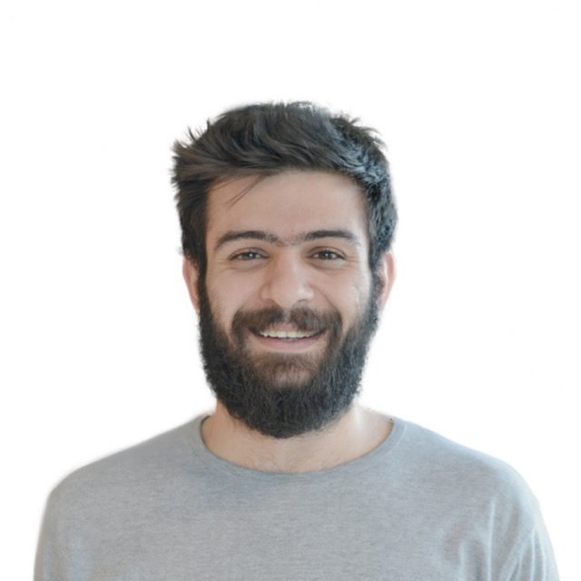

# Flying Acorn

Crafting Extraordinary Gaming Experiences

☰ Menu

  * About
  * Services
  * Projects
  * Team
  * Contact

## About Us

We are a passionate group of game developers with over 5 years of experience
in the gaming industry. Our portfolio boasts over 100 hypercasual prototypes
and several casual games. Specializing in Unity engine development, we're
always excited to take on new game projects and push the boundaries of
interactive entertainment.

## Our Services

  * ### Game Development

Crafting engaging games using Unity for iOS and Android platforms.

  * ### Game Design

Bringing your game concepts to life with our creative design expertise.

  * ### Server & Backend

Implementing robust backend solutions and maintaining player data.

  * ### Ad Campaigns

Creating captivating game creatives and managing effective ad campaigns.

## Our Projects

With a track record of developing games that have amassed millions of
downloads and thousands of daily active users, we've honed our skills in
creating addictive and scalable gaming experiences.

  * 

### Kalamatic

2M+ downloads, 65K+ daily active users

[AppStore](https://apps.apple.com/us/app/%DA%A9%D9%84%D9%85%D8%A7%D8%AA%DB%8C%DA%A9-kalamatic/id1476429715)

  * 

### Couples Yoga

20M+ downloads, #1 on App Store and Google Play

[AppStore](https://apps.apple.com/us/app/couples-yoga/id1563288539)

  * 

### Beauty Salon

$0.29 CPI, 22% D1 retention

[AppStore](https://apps.apple.com/us/app/beauty-salon-3d/id1545813093?l=ru)

  * 

### Doctor Tycoon

$0.19 CPI, 37% D1 retention

[AppStore](https://apps.apple.com/us/app/doctor-tycoon/id1555050989)

### Many More

We have worked on over 100 Hyper-Casual prototypes and Casual games,
encountering various challenges along the way. Our experience includes
developing games that have garnered millions of downloads and maintained
thousands of daily active users, contributing to our expertise in the realm of
large-scale published games.

### Publishers We've Worked With

  * #### Voodoo 

  * #### SuperSonic 

  * #### Moonee 

  * #### Green Panda 

  * #### Homa Games 

  * #### Lion Studio 

  * #### BoomBit 

  * #### Coda Platform 

## Meet Our Team

In the beginning, a startup was founded by a group of robotic enthusiasts keen
on the gaming industry. At first, it was more of a casual venture until the
creation of their groundbreaking game, 'Kalamatic.' Five years later,
'Kalamatic' was sold to pave the way for a new chapter in their journey.

We are flying acorns, free to choose any path, skilled at growing into
towering trees. — Farshad Abdollahi

  * 

### Amir Hakimnejad

Unity & Backend Developer

  * 

### Ali Sharpasand

Founder and CEO

  * 

### Farshad Abdollahi

Unity Developer & Game Designer

  * 

### Mostafa Hassanpour

Unity Developer

## Contact Us

Ready to bring your game idea to life? We're excited to hear from you!

[Get in Touch](mailto:hello@flyingacorn.studio) [Schedule a
Meeting](https://calendly.com/alisharpasand)

Made with ❤️ by Flying Acorn

Espoo, Finland

